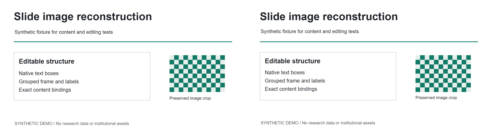

# 自制合成示例

[中文首页](../../README.md) | [真实验证记录](../../docs/validation.md)

这是**自制的合成集成示例**：先将 HTML 参考页截图为 PNG，再重建，没有隐藏的可编辑源演示文稿。
场景与内容由人工明确，仅代表此示例；`prepare_example.py` 不识别任意图片。
示例图和 PPTX 仍使用原来的英文内容，本次只翻译说明，不伪造中文示例或新增验收。

来源：[HTML](source.html)、[输入图片](source.png)。页面只含自制文字/布局与自制栅格图案，没有机构、科研或外部图片素材。
维护者选择暂不设置代码或示例的项目级许可证。



[可编辑 PPTX](overview_editable.pptx)、[WPS 渲染](render-wps.png)、[PowerPoint 渲染](render-powerpoint.png)、[WPS 临时编辑渲染](edit-wps.png)。
分发的 PPTX 是元数据清理后的发布副本；幻灯片内容不变，实际 WPS 渲染与较早的验收渲染一致。
WPS 完整验收通过；PowerPoint 渲染和编辑操作通过，但保存副本的非目标像素严格检查失败。

## 复现步骤

先按[安装说明](../../docs/installation.md)设置真实宿主路径：`REBUILD_SKILL_DIR`、`SKILL_DIR` 及运行时变量。
在兼容宿主中，用配置好的 Python 准备项目并校验：

```powershell
& $env:RUNTIME_PYTHON examples/synthetic-overview/prepare_example.py --project-root scratch --name overview
& $env:RUNTIME_PYTHON skills/rebuild-ppt-image-compare/scripts/validate_specs.py scratch/overview
```

创建 `scratch/overview/src/node_modules` 到宿主包目录的链接。
构建前遵循已安装 Presentations Skill 的 operation marker 规则，然后调用未改变的构建器：

```powershell
& $env:RUNTIME_NODE scratch/overview/src/build_compare.mjs scratch/overview
& $env:RUNTIME_NODE scratch/overview/src/finalize_compare.mjs scratch/overview
& $env:RUNTIME_PYTHON skills/rebuild-ppt-image-compare/scripts/qa_compare_pptx.py scratch/overview/output/overview_editable.pptx --project scratch/overview
```

Windows 下用既有脚本真实渲染，并编辑临时副本：

```powershell
& ./skills/rebuild-ppt-image-compare/scripts/office_render.ps1 -Pptx scratch/overview/output/overview_editable.pptx -Project scratch/overview -Out qa/wps-render -Application WPS
& ./skills/rebuild-ppt-image-compare/scripts/office_render.ps1 -Pptx scratch/overview/output/overview_editable.pptx -Project scratch/overview -Out qa/wps-edit -Application WPS -EditPlan scratch/overview/qa/edit-test-plan.json
```

PowerPoint 使用 `-Application PowerPoint`，并设置独立输出目录。
生成诊断差分，实际审阅证据并完成 `qa/review.json` 后，才运行 Skill 的 `--release` 验收门。
初始化命令拒绝已有项目目录；修复应使用新的修订名称。

## 范围与限制

8 个文字载体、边框、水平线和原生语义分组可编辑。棋盘格保留原始像素裁切，内部像素不是原生对象。
编辑测试用长度相近的文字替换标题，并把分组右移 8 个设计像素。
页面没有表格、连接器、图表数据或原生公式，因此不验证这些能力。

重新截图 HTML 可选依赖 Playwright 和 Chromium，或通过 `SLIDETHAW_BROWSER_CHANNEL` 选择已安装的支持浏览器。
仓库已有输入图片，普通复现不需要 Playwright；未使用付费生成 API。

实际验收结果见[验证记录](../../docs/validation.md)。未报告耗时或还原率。
人工/agent 工作包含审阅输入图、明确场景与审阅真实渲染；HTML 与 Office 间仍有轻微基线差异。
